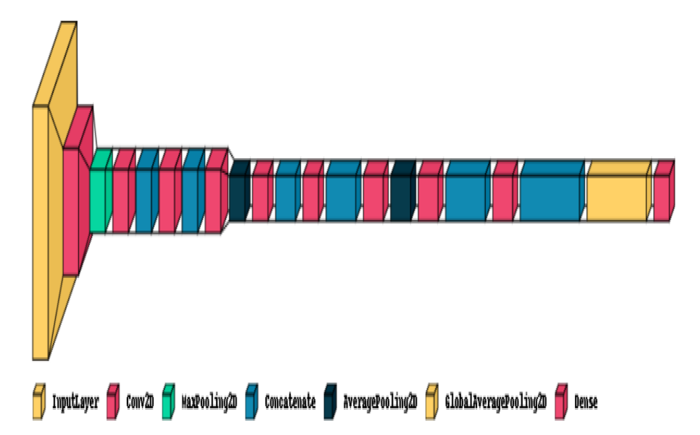
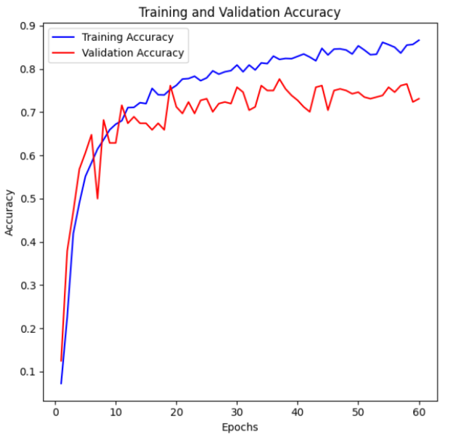

# Malayalam Braille Character recognition using CNN

This project proposes a convolution neural network with a lightweight architecture for automatic Braille image character detection. The proposed method can be used for real-time applications because of its cutting-edge character recognition accuracy and speed.

## Model Architecture 

The DenseNet model had eight layers and a total of 2,489,900 trainable parameters. These layers included the Input layer, the Conv2D layer, the MaxPooling2D layer, the Concatenate layer, AveragePooling2D layer, the GlobalAveragePooling2D layer, and the Dense Layer.

## Performance Metrics 

Using our proposed CNN Model, we obtained a training accuracy of 86.63% with a validation accuracy of 73.11% when the model was trained for 60 epochs.
